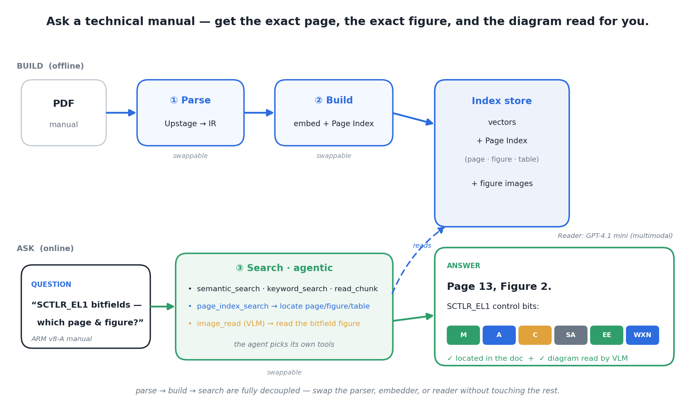

<h1 align="center">lsdrag</h1>
<p align="center"><b>기술 문서에 정확히 답한다 — 어느 페이지·어느 그림·표 안의 값까지 짚고,<br/>다이어그램까지 읽어주는 agentic RAG. Claude Code <code>/rag</code> 한 줄로.</b></p>

<p align="center">
  
  
</p>

<p align="center"></p>
<p align="center"><sub><b>parse → build → search</b>, 세 단계가 완전히 분리되어 있고, 검색은 스스로 도구를 골라 답의 위치를 짚는다.</sub></p>

## What & Why
방대한 매뉴얼·스펙·레퍼런스에 질문하면, **"어느 페이지·어느 Figure·어느 표"** 까지 짚어 답하고
필요하면 그 **그림(비트필드 다이어그램 등)을 직접 읽어** 설명하는 사내용 agentic RAG다.
일반 검색이 "비슷한 문장 조각"을 돌려주고 마는 자리에서, lsdrag는 위치를 특정하고 시각 정보까지 근거로 삼는다.

- 🎯 **위치까지 답한다** — 페이지·Figure·표를 짚어 인용한다. "어디에 있나"에 정확히 답.
- 🖼️ **그림을 읽는다** — 멀티모달 Reader가 다이어그램을 해석해 텍스트로 설명(별도 VLM 백엔드 불필요).
- 🧭 **agentic** — 에이전트가 질문에 맞는 도구(의미검색·구조검색·이미지읽기)를 스스로 선택.
- 🧩 **세 단계 완전 분리** — 파싱·임베더·Reader를 다른 부품으로 통째 교체 가능(사내 이식 쉬움).
- ➕ **문서 증분 관리** — 전체 재빌드 없이 문서만 추가/제거. 삭제도 한 명령.
- 🩺 **설치가 스스로 점검** — `doctor`가 9단계로 막힌 지점과 조치를 사람 말로 알려준다.

## Quick Start
```bash
export UP_TOKEN=...  OPENAI_API_KEY=...        # 파서 / Reader 키 (env, 평문 커밋 금지)
cp -r rag ~/.claude/skills/rag                 # skill 설치
python -m src.indexing.build --config config.yaml   # 문서 → 인덱스
python rag/scripts/doctor.py --json            # 전부 ✅면 끝
```
자세한 절차 → [INSTALL.md](INSTALL.md)

## Usage

### 1) 문서 준비 — 큰 PDF를 파서가 소화할 크기로 분할
```bash
# 매뉴얼을 ≤100p 조각으로 자르고, 그림+표가 있는 본문 1조각만 사용
python scripts/split_pdf.py --input examples/ARMv8-Reference-Manual.pdf \
    --ranges "1500-1560" --out examples/parts/
cp examples/parts/ARMv8-Reference-Manual_part1.pdf ./data/docs_in/
```

### 2) 파싱 + DB 빌드 — 문서를 검색 가능한 인덱스로
```bash
python -m src.indexing.build --config config.yaml
```
이 한 줄이 내부에서: **Upstage로 파싱 → 공통 IR로 변환 → 임베딩 + Page Index(페이지·Figure·표 메타) → 인덱스 저장**.
산출물은 `config.yaml`의 `paths.*`에 쌓인다(`chunks`, `index`, `page_index`, `images`).
문서를 더 넣거나 빼려면 전체 재빌드 없이:
```bash
python rag/scripts/docs.py add  새문서.pdf      # 추가(파싱→인덱스 증분)
python rag/scripts/docs.py remove <doc_id>      # 제거
python rag/scripts/docs.py list                 # 현재 색인된 문서
```

### 3) 질문하기
```
> /rag SCTLR_EL1 레지스터는 무엇을 제어하나?
< 시스템 동작 제어… (근거 페이지와 함께)

> /rag SCTLR_EL1 비트필드는 몇 페이지 어느 figure에 있나?
< page_index_search로 위치 특정 → 13페이지 Figure 2.
  그 그림을 image_read(VLM)가 읽어 비트필드(M/A/C/…)를 설명.
```

## Requirements
| 구성 | 무엇 | 준비물 |
|------|------|--------|
| 파서 | Upstage Document Parse (원격 API) | `UP_TOKEN` (env) |
| Reader / 이미지 해석 | GPT-4.1 mini · 멀티모달 (원격 API) | `OPENAI_API_KEY` (env) |
| 임베더 | sentence-transformers (로컬 자동 로드) | **GPU 불필요** |
| 런타임 | Python 3.10+ | `pyyaml numpy requests sentence-transformers tiktoken pypdf` |

> 자체 GPU 서빙 없음(임베더는 로컬·소형, 파서·Reader는 외부 API).
> 각 구성은 통째로 교체 가능 — 파서는 `src/parser/adapter.py`, Reader·임베더는 `config.yaml` 한 곳.

## Project layout
```
lsdrag/
├── docs/        모듈 명세 (00~10) + Figure
├── src/         schema · parser · page_index · indexing · retrieval · agent/vendor
├── rag/         skill (SKILL.md, run · docs · doctor · uninstall)
├── examples/    ARM v8-A 예시 PDF
└── tests/       회귀 + E2E + 페르소나 수용 테스트
```

## Install
요약은 위 Quick Start, 전체 절차는 [INSTALL.md](INSTALL.md). 삭제: `python rag/scripts/uninstall.py`.

## Credits & License
MIT. 검색 엔진은 [A-RAG](https://github.com/Ayanami0730/arag)(@`a44de6b`, MIT)를 vendoring해 확장.
가져온/지운 파일 목록은 [`src/agent/vendor/SOURCE.md`](src/agent/vendor/SOURCE.md).
