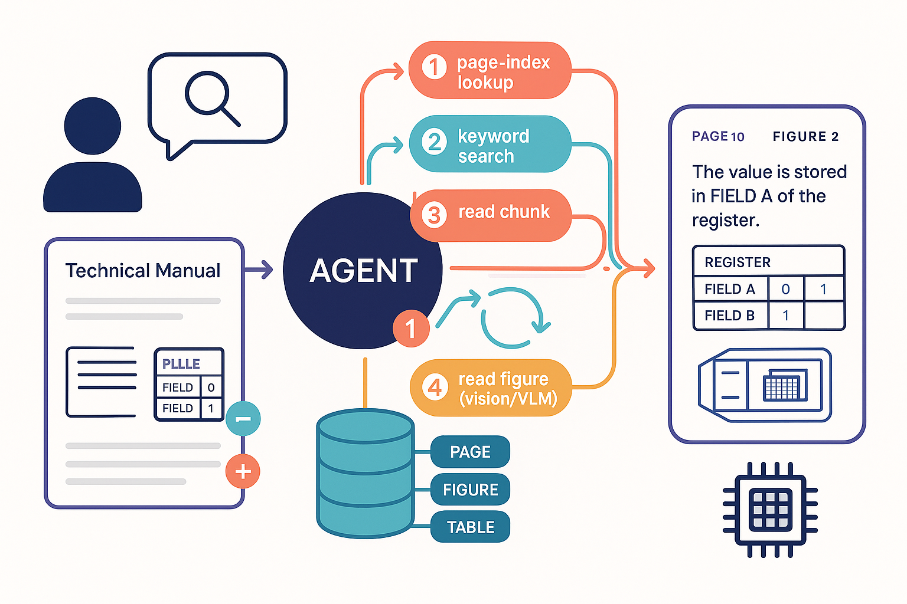
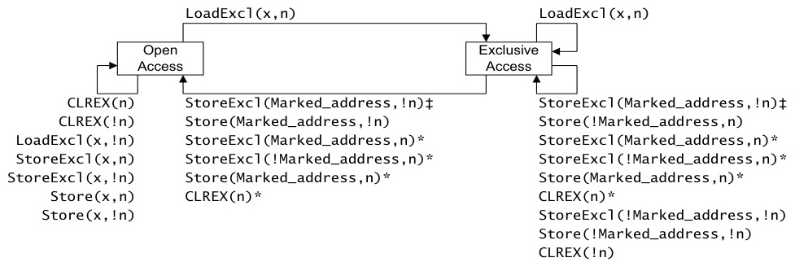

<h1 align="center">LSD-RAG</h1>
<p align="center"><b>기술 문서에서 어느 페이지·어느 그림·표 안의 값까지 짚고,<br/>다이어그램까지 읽어주는 agentic RAG. Claude Code <code>/rag</code> 한 줄로.</b></p>

<p align="center">
  
  
</p>

<p align="center"></p>
<p align="center"><sub>HW 매뉴얼을 읽는 에이전트 — <b>locate page · find figure · read diagram</b> 도구를 스스로 골라, 답이 <b>몇 페이지·어느 Figure</b>에 있는지 짚는다.</sub></p>

## What & Why
방대한 매뉴얼·스펙·레퍼런스에 질문하면, **"어느 페이지·어느 Figure·어느 표"** 까지 짚어 답하고
필요하면 그 **그림(비트필드 다이어그램 등)을 직접 읽어** 설명하는 사내용 agentic RAG다.
일반 검색이 "비슷한 문장 조각"을 돌려주고 마는 자리에서, LSD-RAG는 위치를 특정하고 시각 정보까지 근거로 삼는다.

- 🎯 **위치까지 답한다** — 페이지·Figure·표를 짚어 인용한다. "어디에 있나"에 정확히 답.
- 🖼️ **그림을 읽는다** — 멀티모달 Reader가 다이어그램을 해석해 텍스트로 설명(별도 VLM 백엔드 불필요).
- 🧭 **agentic** — 에이전트가 질문에 맞는 도구(의미검색·구조검색·이미지읽기)를 스스로 선택.
- 🧩 **세 단계 완전 분리** — 파싱·임베더·Reader를 다른 부품으로 통째 교체 가능(사내 이식 쉬움).
- ➕ **문서 증분 관리** — 전체 재빌드 없이 문서만 추가/제거. 삭제도 한 명령.
- 🩺 **설치가 스스로 점검** — `doctor`가 9단계로 막힌 지점과 조치를 사람 말로 알려준다.

## Quick Start
```bash
export UP_TOKEN=...  OPENAI_API_KEY=...        # 파서 / Reader 키 (env, 평문 커밋 금지)
cp -r rag ~/.claude/skills/rag                 # skill 설치
python -m src.indexing.build --config config.yaml   # 문서 → 인덱스
python rag/scripts/doctor.py --json            # 전부 ✅면 끝
```
자세한 절차 → [INSTALL.md](INSTALL.md)

## Usage

### 1) 문서 준비 — 큰 PDF를 파서가 소화할 크기로 분할
```bash
# 매뉴얼을 ≤100p 조각으로 자르고, 그림+표가 있는 본문 1조각만 사용
# (검증된 예: 2785-2810 구간 = 상태 다이어그램 figure + 표 포함)
python scripts/split_pdf.py --input examples/ARMv8-Reference-Manual.pdf \
    --ranges "2785-2810" --out examples/parts/
cp examples/parts/ARMv8-Reference-Manual_part1.pdf ./data/docs_in/
```

### 2) 파싱 + DB 빌드 — 문서를 검색 가능한 인덱스로
```bash
python -m src.indexing.build --config config.yaml
```
이 한 줄이 내부에서: **Upstage로 파싱 → 공통 IR로 변환 → 임베딩 + Page Index(페이지·Figure·표 메타) → 인덱스 저장**.

DB는 `config.yaml`의 `paths.*`에 다음 형태로 저장된다:
| 파일 | 형태 |
|------|------|
| `index/chunks.json` | `[{id, text}]` — 청크 본문 |
| `index/sentence_index.pkl` | `{sentences, embeddings, sentence_to_chunk, chunks}` — 벡터(A-RAG 호환) |
| `page_index/page_index.json` | 구조 인덱스(page·figure·table·heading + chunk_id + image_path) |
| `index/manifest.json` | doc_id → chunk_ids·image_paths (증분 add/remove용) |
| `data/images/*.png` | **figure만** crop 저장(표는 HTML 구조로 chunk에 보존, 이미지 불필요) |

### 3) Claude Code 스킬 명령어
설치 후 Claude Code 대화창에 아래 슬래시 명령을 입력하면 된다(내부 복잡성은 감춰진다).

| 명령 | 하는 일 | 예시 |
|------|---------|------|
| `/rag-parse <pdf>` | **파싱 점검** — 문서를 IR로 변환해 표·그림 추출 상태 확인(빌드 전) | `/rag-parse manual.pdf` |
| `/rag-build` | **DB 빌드 / 문서 관리** — 인덱스 생성, 증분 add·remove, 현황(`--list`) | `/rag-build`<br>`/rag-build --add new.pdf`<br>`/rag-build --remove <doc_id>`<br>`/rag-build --list` |
| `/rag <질문>` | **검색·질의응답** — 에이전트가 page_index·VLM을 자동으로 골라 답 | `/rag SCTLR_EL1 비트필드는 몇 페이지 어느 figure에 있나?` |

`/rag` 질의 시 에이전트가 어떤 단계로 도구를 호출하는지는 위 대표 그림의 trajectory를 참고.

## How it works — 실제 검색 예시 (ARM v8-A 매뉴얼)
> 아래는 fresh clone에서 **실제 Upstage·GPT-4.1 mini로 돌린 결과**다(자세한 검증은
> [`examples/REPORT.md`](examples/REPORT.md)).

**질문**: “ARM exclusive memory access 상태 전이 다이어그램 — 어디에 있고 무엇을 의미하나?”

**에이전트의 검색 경로**
1. `page_index_search` → 해당 figure의 **위치를 특정**하고 본문 + 이미지 경로를 함께 반환.
2. `image_read(VLM)` → 그 자리에서 **잘라낸(crop) 그림을 GPT-4.1 mini가 직접 읽음**:

<p align="center"></p>

**답변(요지)**: *Open Access ↔ Exclusive Access 두 상태를 `LoadExcl`로 전이하고,
`StoreExcl`/`Store`/`CLREX`가 `n`·`!n` 비트 상태와 `Marked_address`에 따라 모니터를 갱신·해제한다.*
→ **위치를 짚고(page_index) + 그림까지 읽어(VLM)** 근거 있는 답을 만든다.

세 단계는 완전히 분리되어 통째로 교체 가능 — 파서는 `src/parser/adapter.py`, Reader·임베더는 `config.yaml` 한 곳.

## Requirements
| 구성 | 무엇 | 준비물 |
|------|------|--------|
| 파서 | Upstage Document Parse (원격 API) | `UP_TOKEN` (env) |
| Reader / 이미지 해석 | GPT-4.1 mini · 멀티모달 (원격 API) | `OPENAI_API_KEY` (env) |
| 임베더 | sentence-transformers (로컬 자동 로드) | **GPU 불필요** |
| 런타임 | Python 3.10+ | `pyyaml numpy requests sentence-transformers tiktoken pypdf pikepdf` |

> 자체 GPU 서빙 없음(임베더는 로컬·소형, 파서·Reader는 외부 API).
> 각 구성은 통째로 교체 가능 — 파서는 `src/parser/adapter.py`, Reader·임베더는 `config.yaml` 한 곳.

## Project layout
```
lsdrag/
├── docs/        모듈 명세 (00~10) + Figure
├── src/         schema · parser · page_index · indexing · retrieval · agent/vendor
├── rag/         skill (SKILL.md, run · docs · doctor · uninstall)
├── examples/    ARM v8-A 예시 PDF
└── tests/       회귀 + E2E + 페르소나 수용 테스트
```

## Install
**Claude Code에 그냥 말로 시키면 된다** — *"이 repo의 rag skill 설치해줘"* 라고 하면
[INSTALL.md](INSTALL.md)를 따라 단계마다 `doctor`로 self-check하며, 실패하면 멈추고 조치를 알려준 뒤 진행한다.
수동 요약은 위 Quick Start. 삭제: `python rag/scripts/uninstall.py`.

## Credits & License
MIT. 검색 엔진은 [A-RAG](https://github.com/Ayanami0730/arag)(@`a44de6b`, MIT)를 vendoring해 확장.
가져온/지운 파일 목록은 [`src/agent/vendor/SOURCE.md`](src/agent/vendor/SOURCE.md).
